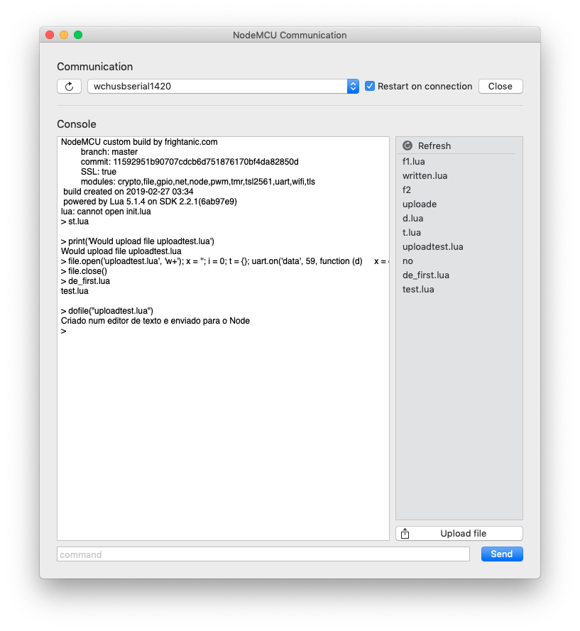
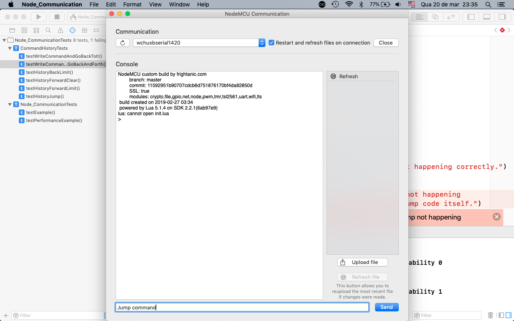
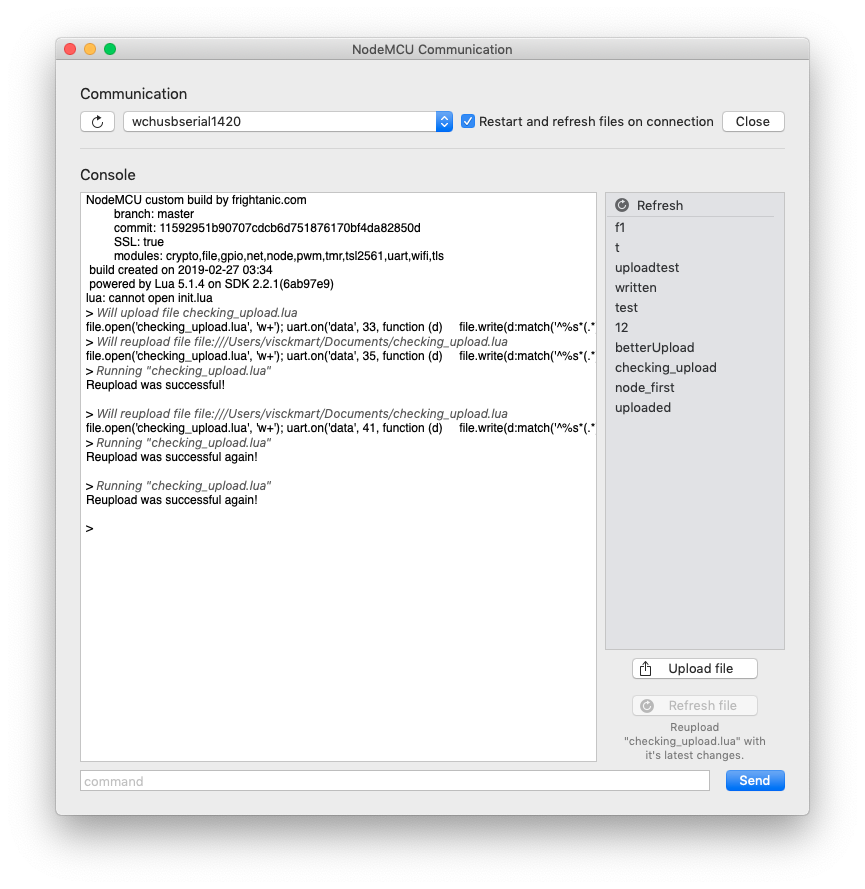

# MicrocontrollerUI
Aplicativo para Mac desenvolvido no início de 2019 para monitorar e controlar um micro-controlador (NodeMCU).

Ao conectar um micro-controlador pelo USB no Mac e abrir o aplicativo ele aparecerá na lista de dispositivos conectados.
Ao ser escolhido, o aplicativo tenta se conectar e **lista todos os arquivos** .lua que estão contidos nele.

É possível **enviar comandos** diretamente para o micro-controlador e por meio da interface
o usuário pode **executar os programas** contidos no dispositivo, **visualizar a saída** em tempo real,
**enviar novos programas e reenviá-los** com apenas um clique caso alterações tenham sido feitas desde o último envio do programa.

### Exemplo de uso

### Executando os testes unitários

### Exemplo com feedback na interface

